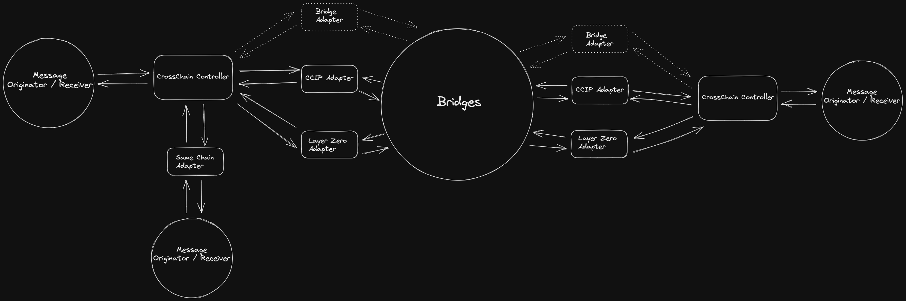
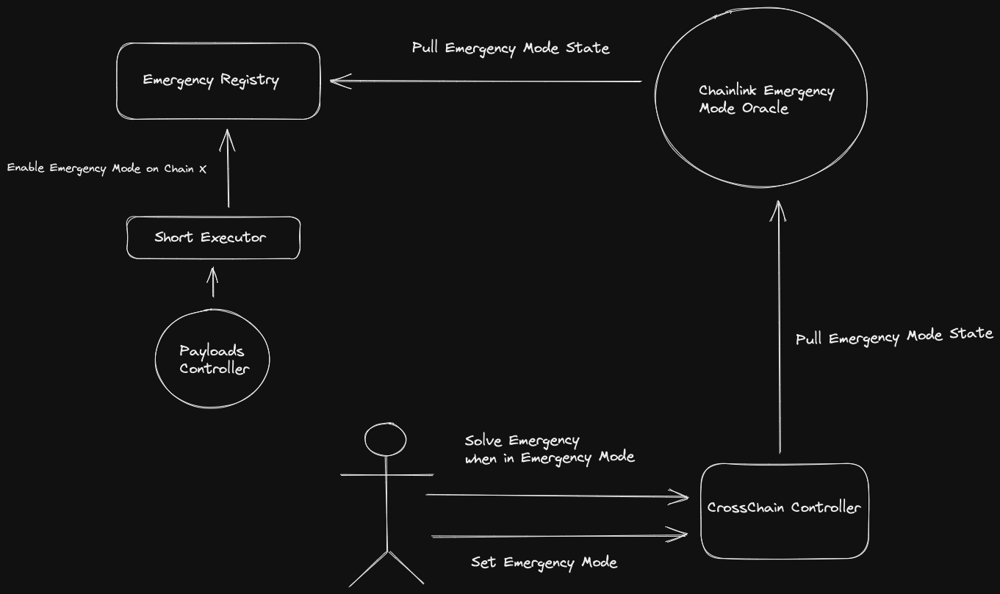

# Aave CrossChain Infrastructure



## Overview

The Ghost Cross Chain Infrastructure enables the communication between different chains, by using
different bridges to pass messages. A message is considered valid if it has been bridged by at
least a defined number of bridges. Messages can be invalidated if a bridge is hacked.

### Strucure

- CrossChainController: Main cross chain infrastructure contract, containing the logic to bridge messages
  from chain A to chain B. To send or receive messages to / from another chain, the smart contracts
  need to be registered first.
  This contract also has the funds to pay for the fees accrued by the different bridges.
  A message will be sent to all the bridges registered to the destination chain.
  A message will be considered completely bridged and pushed to recipient, once at least a defined number
  of bridges have bridged the message.

- Bridge Adapters: Minimal smart contracts that know how to send / receive messages to a specific
  bridge. The SameChain Adapter, bypasses cross chain communication, to send the messages directly
  to the recipient contracts.

### Permissions

- CrossChainController:
  - Owner: Short Executor. Can execute all setters and getters, configuration changes etc...
  - Admin: Guardian: there are limited actions the Guardian can do on CrossChainController:
    - RetryMessage
    - SolveEmergency (Only when on Emergency is active)
- Bridge Adapters:
  - Bridge Adapter contracts are immutable

## CrossChain Contracts

- [CrossChainForwarder](./src/contracts/CrossChainForwarder.sol): Abstract contract that has the logic to send messages
  to other connected chains. To be able to send messages, the destination chain, with its receiver must have been
  previously registered, and the caller must also be an approved sender. Apart from the approved senders, the Guardian will
  be able to retry sending previously sent messages. This can happen when there wasn`t enough gas, or the message failed
  to arrive to the destination for whatever reason.
- [CrossChainReceiver](./src/contracts/CrossChainReceiver.sol): Abstract contract that has the logic to receive messages
  from other chains. To route a message to the destination address, the message needs to be received correctly (from the
  different allowed bridges) a certain amount of times. To be received correctly it means that it must be the exact same
  message received by the other bridges (n amount of bridges). For a destination to receive the message, it must implement
  this specific [interface](./src/contracts/interfaces/IBaseReceiverPortal.sol)
- [CrossChainController](./src/contracts/CrossChainController.sol): Contract that implements CrossChainForwarder and CrossChainReceiver
  to be the entry point to the cross chain infrastructure. This contract also holds the funds to pay for the usage of the
  different registered bridges. If by some reason there are some of the registered bridges that have been hacked, an estate
  of emergency will be activated. Once in an emergency state, the guardian will have power to update the CrossChainController
  configuration, to remove the affected bridges and invalidate the messages that have been affected.

## Bridge Adapters

- [BaseAdapter](./src/contracts/adapters/BaseAdapter.sol): Abstract contract that must be implemented by the bridge adapters.
  It has the method that will route the bridged message to the destination address, and the method interface needed to
  forward messages to the destination chain.
- BridgeAdapters: These are the different contracts that by implementing the BaseAdapter will communicate with the
  different bridge providers. The list of currently integrated bridge providers is:
  - [CCIP](./src/contracts/adapters/ccip/CCIPAdapter.sol)
  - [HyperLane](./src/contracts/adapters/hyperLane/HyperLaneAdapter.sol)
  - [LayerZero](./src/contracts/adapters/layerZero/LayerZeroAdapter.sol)

-[SameChainAdapter](./src/contracts/adapters/sameChain/SameChainAdapter.sol): Adapter that only implements the method to
send messages, by directly communicating with the receiving contract in the same chain where it is deployed. This way, by
using this adapter, it can bypass the cross chain bridging.

# Aave Governance Emergency Mode



## Overview

The Aave Emergency Mode is a system that enables the governance to signal other chains
connected to the Aave Cross Chain Infrastructure, that they should enter emergency mode.
Entering Emergency Mode means that the Guardian receives special permissions to update
the CrossChainController contract with new configs.
This enables the system to give limited permissions to a Guardian, while maintaining the
possibility to fix the system if the cross chain communication and execution infrastructure breaks.

### Contracts

- [EmergencyRegistry](./src/contracts/EmergencyRegistry.sol): Contract containing the registry of the emergency counts for every chain.
  The emergency count will be incremented by 1 when entering a new emergency on the specific chain.

  - Owned by Short Executor.

- Chainlink Emergency Mode Oracle: This oracle (on all chains) will be updated by Chainlink whenever a new emergency
  is updated on the EmergencyRegistry contract. Will update the answer with the new emergency number.

### Permissions

- Enable Emergency: Short Executor is the only one that can activate an emergency mode in any chain.
  This means that to activate an emergency mode, a vote will need to pass. If cross chain is broken, then the vote
  will happen in the same chain.
- Set Emergency: This call on the CrossChainController contract can be done by anyone, as it will check the
  Chainlink Emergency Mode Oracle for the correct state of emergency.
- Solve Emergency: This is callable by the Guardian, and only when in Emergency Mode.

## Development

This project uses foundry. To install run:

```
npm i // install package dependencies
forge install // install dependency libraries
```

To be able to run the tests you will need to fill a `.env` file with your keys. Take the `.env.example` as base:

```
cp .env.example .env
```

To run the tests:

```
forge test
```

## License

Copyright © 2023, [BGD Labs](https://bgdlabs.com/). Released under the [MIT License](./LICENSE).
